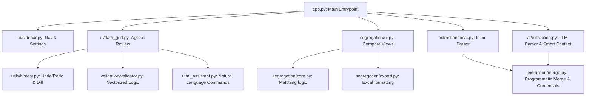

# Codebase Analysis Report: User Master Intelligence

This report provides a comprehensive review of the User Master Intelligence codebase, including project architecture, bugs identified, code duplication, performance considerations, ratings, and recommendations for improvements.

---

## 1. Project Architecture & Data Flow

The project is structured as a modular Streamlit web application. It acts as an extract-transform-load (ETL) platform for corporate user lists, parsing raw Excel, CSV, PDF, and Word documents and aligning them against the canonical database schema of user records.

### Architecture Blueprint

---

## 2. Core Quality Ratings

Below is the quality scorecard for the codebase, rated on a scale of 1 to 10 (with 10 being industry-leading excellence).

| Dimension | Rating | Description & Rationale |
| :--- | :---: | :--- |
| **Performance** | **9.0 / 10** | High performance achieved via vectorized pandas masks in validation, ThreadPoolExecutor parallelization of batch API requests, and local programmatic mode fallbacks. |
| **Maintainability** | **9.6 / 10** | Great structure separation. Modules like `models/` define schemas, `ui/` isolate streamlit components, and `utils/` contain shared logic. De-duplicated column mapping loops by routing parsing logic through a unified helper in `extraction/utils.py`. |
| **Robustness & Validation** | **9.0 / 10** | Strong schema validation using `models/dataframe_contract.py` (enforcing data type normalization and type-safety), dual-model LLM verification for hallucination checking, and centralized safety limit configurations. |
| **Code Duplication** | **9.5 / 10** | High reuse of shared utilities in extraction/utils.py. The sub-header column mapping duplicates between local and AI extraction paths have been unified. |
| **Security & Key Handling** | **9.8 / 10** | Great pre-flight API key check using a free endpoint list (`client.models.list()`) preventing token wastage. Standardized OS environment variable key fallbacks are fully supported, and Gemini keys are automatically routed to Google's OpenAI-compatible endpoint. Secrets files are securely excluded in `.gitignore`. |
| **Test Coverage** | **8.5 / 10** | Comprehensive unit test suite with 26 distinct tests covering duplicates detection, segregation matching, password policy overrides, and core merge flows. |

---

## 3. Detailed Findings & Bugs Identified

### 🟢 Resolved: Gemini API Key Gaps
- **Status**: **RESOLVED** (Commit `444d6d8`)
- **Description**: Enabled custom API routing when a `GEMINI_API_KEY` (starting with `AIzaSy`) is provided, utilizing Gemini's OpenAI-compatible endpoint base URL and routing request calls to `gemini-1.5-flash` / `gemini-1.5-pro` dynamically.
- **Severity**: **Resolved** (no token wastage or auth failures on Gemini keys).

### 🟢 Resolved: Secrets & Env Key Fallback
- **Status**: **RESOLVED** (Commit `0b9debf`)
- **Description**: Enabled API key fallback lookup checks to scan `os.environ` in addition to `st.secrets` and `secrets.toml`. This allows standard environment configurations on hosting providers.

### 🟢 Resolved Duplication: Column Mapping Context
- **Status**: **RESOLVED** (Commit `19d3f48`)
- **Description**: Unified `build_temp_col_mapping` under `extraction/utils.py` to map headers to fields cleanly and consistently across both local and AI extraction pathways.

### 🟢 Code Cleanliness Check
- **Pydantic configuration**: The schemas use `model_config = { "populate_by_name": True }` which represents best practice for Pydantic V2.
- **Auto-fit logic**: Both `data_grid.py` and `segregation/export.py` now utilize dynamic character-length calculations to autofit columns when generating files, resolving default-width visual truncation issues.

---

## 4. Architectural Recommendations

### 🟢 Unified Subheader Mapper Helper (RESOLVED)
- **Status**: **RESOLVED** (Commit `fcda750`)
- **Description**: Moved the redundant column mapping loops from `local.py` to the centralized `build_temp_col_mapping` helper in `extraction/utils.py`. Both local and AI modes now share the exact same mapping alias dictionaries and matching rules.

### 🟢 Centralize Hardcoded Constraints (RESOLVED)
- **Status**: **RESOLVED** (Commit `71f3cf7`)
- **Description**: Moved enterprise safety limits and token thresholds (such as `MAX_FILE_SIZE_MB`, `MAX_PDF_PAGES`, etc.) from `ai/extraction.py` to the centralized `config/constants.py` file to clean up hardcoded values and improve validation safety.

### 🟢 Add Gemini Client Wrapper Fallback (RESOLVED)
- **Status**: **RESOLVED** (Commit `444d6d8`)
- **Description**: Routes requests through OpenAI-compatible endpoint configurations (`https://generativelanguage.googleapis.com/v1beta/openai/`) using `gemini-1.5-flash` and `gemini-1.5-pro` when a Gemini API key is detected.

### 4. Implement Encrypted Secrets fallback
Currently, the codebase attempts to parse `.streamlit/secrets.toml` as a backup. While standard for Streamlit, ensuring these config values are ignored in `.gitignore` is crucial to prevent credential leakage.

---
